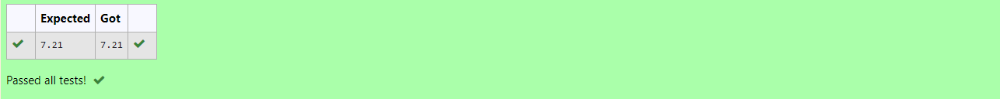

# DISTANCE-BETWEEN-TWO-POINTS

## AIM:
To write a python program to find the distance two 2 points
## ALGORITHM:
### Step 1: 
Import math library using import math
### Step 2: 
Create two lists and give values to each of them
### Step 3: 
Substitute the values in the distance formula  
### Step 4: 
Use the given formula to get the output, give x1 as the first value of list1 and x2 as the first value of list2, y1 as the second value of list1 and y2 as the second value of list2
### Step 5: 
Print the ouput to two deciaml places and end the program
### PROGRAM:
```
#Program to find the distance between two points.
#Developed by: Ronick Aakshath P
#RegisterNumber: 22007303

import math

l2 = [10, 6]
l1 = [4, 2]

d = math.sqrt(((l2[0]-l1[0])**2)+((l2[1]-l1[1])**2))
print("{:.2f}".format(d))
```
### OUTPUT:


### RESULT:
Thus the distance between two points is successfully executed
